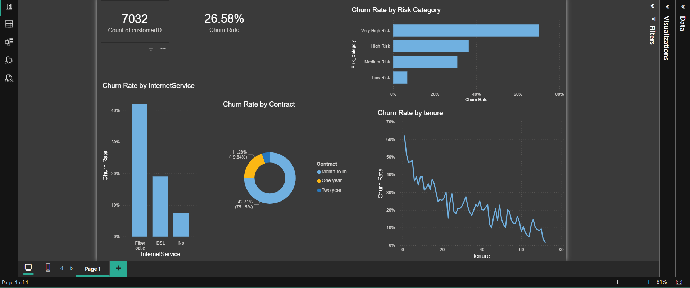

## 📊 Project Dashboard

This is a **simple and clean dashboard** designed for quick decision-making. It avoids clutter and focuses directly on the core business problem: understanding why customers are leaving.



---

## 💼 Executive Presentation (PDF)

A clean and well-structured report containing the complete project summary, MySQL risk logic, and strategic business recommendations.

👉 **[View Executive Report (PDF)](customer_churn_project.pdf)** 
*(Note: Change 'customer_churn_project.pdf' to your exact PDF file name)*

---

### 🧠 Core DAX Measure

The entire dashboard updates dynamically based on user selection using this clean calculation:

```text
Churn Rate % = DIVIDE([Total Churned], COUNT(customer_churn[customerID]), 0) * 100
